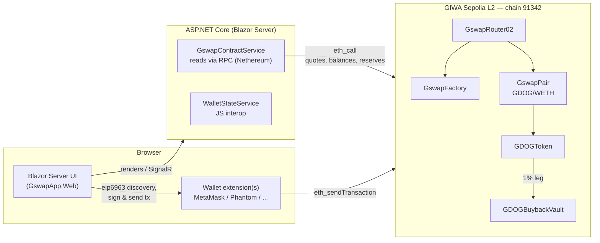
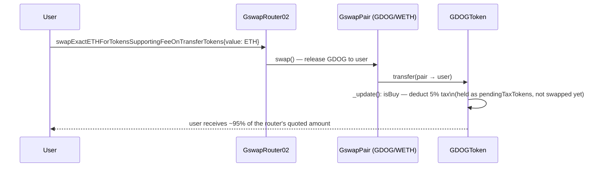
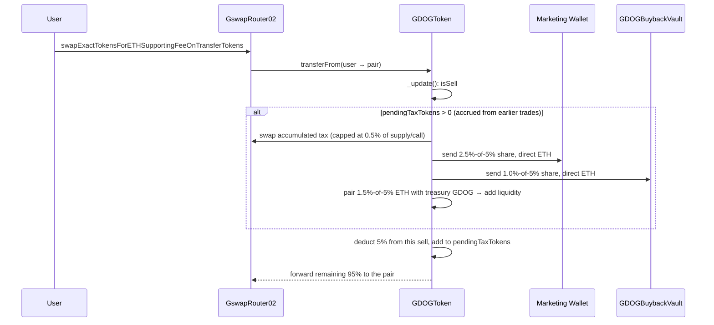
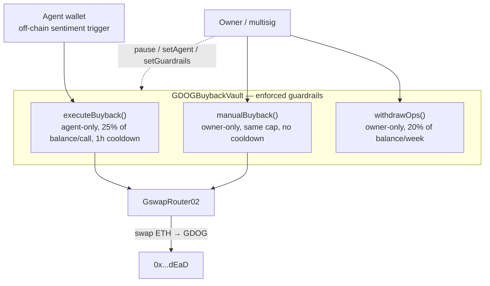
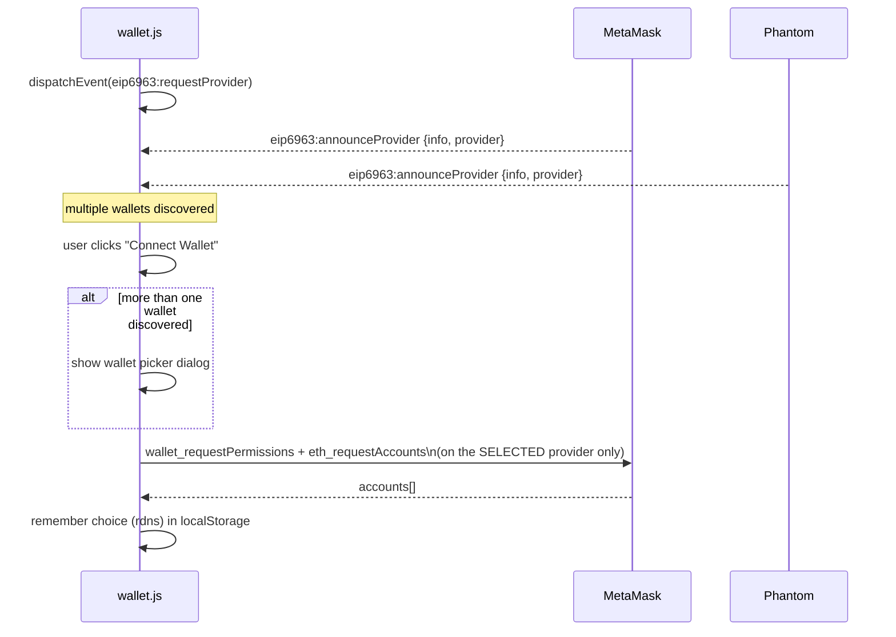

# GSWAP & GDOG — Technical Design

**A Uniswap V2-equivalent AMM (GSWAP) built from scratch for GIWA L2, and a receiver-side-tax launch token (GDOG) trading live on it.**

Two products, one repo, sharing GIWA as their chain and Blazor Server/Nethereum as their app stack — the same architecture already used for Ubuntu Escrow ([TECHNICAL_DESIGN.md](TECHNICAL_DESIGN.md)), applied to DeFi instead of escrow.

- **Live app:** run `frontend/GswapApp.Web` (`dotnet run`) — see [Frontend](#frontend--gswapappweb)
- **Network:** GIWA Sepolia, chain ID `91342`, RPC `https://sepolia-rpc.giwa.io`, explorer `https://sepolia-explorer.giwa.io`
- **Repo:** https://github.com/block0xhash/ubuntu-escrow

## Live Deployment

All six contracts are deployed and verified on Blockscout.

| Contract | Address | Role |
|---|---|---|
| `WETH9` | [`0xeF5347ce916c5a927be50169f418D8bDAAB17b5B`](https://sepolia-explorer.giwa.io/address/0xef5347ce916c5a927be50169f418d8bdaab17b5b) | Wrapped ETH — what every GSWAP pool treats as "ETH" |
| `GswapFactory` | [`0x62856877AC4c7938Cc6d114491f61088946ec5C2`](https://sepolia-explorer.giwa.io/address/0x62856877ac4c7938cc6d114491f61088946ec5c2) | Creates and tracks pairs |
| `GswapRouter02` | [`0x9983ab76FC16Cd6F8A2Fb4bcE28f36Bec13A792d`](https://sepolia-explorer.giwa.io/address/0x9983ab76fc16cd6f8a2fb4bce28f36bec13a792d) | User-facing swap/liquidity entry point |
| `GDOGToken` | [`0x33545c9d9D66A19054AA8eB2401E24F084C493e0`](https://sepolia-explorer.giwa.io/address/0x33545c9d9d66a19054aa8eb2401e24f084c493e0) | The token itself |
| `GswapPair` (GDOG/WETH) | [`0xF28bf3a6f7dF23D7AE8f0CA09C6551AFe5972E60`](https://sepolia-explorer.giwa.io/address/0xf28bf3a6f7df23d7ae8f0ca09c6551afe5972e60) | Auto-created by GDOGToken's constructor |
| `GDOGBuybackVault` | [`0x50879D0d2229080a2019366752bC22688D38013A`](https://sepolia-explorer.giwa.io/address/0x50879d0d2229080a2019366752bc22688d38013a) | Holds and spends the buyback fund |

Trading is live: pool seeded with 10 ETH / 200,000,000 GDOG (opening price 1 ETH = 20,000,000 GDOG), `enableTrading()` called, anti-snipe decay window long since elapsed at GIWA's 1-second block time.

### Roles

| Role | Address | Notes |
|---|---|---|
| Owner / deployer | `0xc3e32792653620f5F218db3F9A3925723E40B1c7` | Controls both contracts: `enableTrading`, `setAgent`, `setMarketingWallet`, `raiseLimits`, `pause`, `withdrawOps` |
| Marketing wallet | `0x85E2008E3599800A3cA06676f77820f386A84a5a` | Plain EOA — receives the 2.5% tax leg directly, spendable immediately, no contract call needed |
| Buyback agent | `0xf7A8839434090F229dd7411B07791FcC13262733` | Permission-only — never holds funds itself, must call `executeBuyback()` to move the vault's balance |
| LP-lock wallet | `0x579Ef999DbEcAE01189301f9F40D7de512224eBE` | Holds the pool's LP tokens. **Not a real lock** — a regular EOA, not a burn address or timelock contract. See [Known Limitations](#known-limitations--honest-scope-notes) |
| Spare | `0x5D2bAf5b7CE9aC98cB4b1dB05B5A23D90f4662a4` | Unassigned (also the Ubuntu Escrow treasury address, reused) |

## Architecture

Same split as the escrow app: **Solidity is the source of truth for funds**, the C# layer only reads chain state and encodes calldata — it never holds a key or signs anything. Every write goes through the user's own wallet.

## GSWAP — the AMM

A from-scratch Uniswap V2-equivalent, not a thin wrapper: `GswapFactory` + `GswapPair` + `GswapRouter02` + `WETH9`, in `contracts/src/gswap/`.

| Contract | What it does |
|---|---|
| `GswapPair` | Constant-product (`x*y=k`) pool, standard 0.3% swap fee, `MINIMUM_LIQUIDITY` permanently locked on first mint, TWAP price accumulators, optional 1/6-of-fee protocol cut (`feeTo`, currently unset), reentrancy `lock` modifier |
| `GswapFactory` | Creates pairs via `CREATE2`, tracks `getPair`/`allPairs` |
| `GswapRouter02` | Full V2 function set — exact-in/exact-out swaps in all ETH/token directions, add/remove liquidity, plus the fee-on-transfer-safe `*SupportingFeeOnTransferTokens` variants GDOG needs |
| `GswapLibrary` | Pure quote math (`getAmountOut`/`getAmountIn`/`getAmountsOut`/`getAmountsIn`) shared by the router and anything that wants to price a route off-chain |

**Deliberate deviation from real Uniswap V2:** `GswapLibrary.pairFor()` resolves a pair via `factory.getPair()` — a state read — instead of predicting the address off-chain via `CREATE2` + a hardcoded init-code-hash constant. The real Uniswap pattern saves one `SLOAD` of gas but is brittle: that hash has to be regenerated by hand every time `GswapPair`'s bytecode changes, and a stale hash fails silently (the router computes a wrong address and every call reverts or, worse, targets nothing). Not a trade worth making for a new deployment.

**Deliberately omitted:** the V2 flash-swap callback (`swap()` invoking the recipient with calldata) — nothing in GDOG or the frontend depends on it, and cutting it keeps the audited surface smaller.

### Swap flow (buy)

The router's `getAmountsOut` only knows pair reserves — it has no visibility into GDOG's own transfer-tax hook, so any frontend quoting against it must correct for the token's tax separately (see [GDOG](#gdog--the-tax-token)).

## GDOG — the tax token

`GDOGToken.sol` + `GDOGBuybackVault.sol`, in `contracts/src/`. Receiver-side tax: intercepts trades and extracts the 5% tax in native ETH, converted in small bounded increments rather than accumulated and dumped — the pattern that avoids the visible sell-wall candle a classic "swap-and-liquify" token prints.

### Tax split (5% total, buy and sell)

| Leg | Share | Destination | Mechanism |
|---|---|---|---|
| Marketing | 2.5% | Marketing wallet | Direct ETH send |
| Auto-liquidity | 1.5% | Pool (paired with **treasury** GDOG, never taxed tokens) | `addLiquidityETH`, LP tokens → lock wallet |
| Dev / buyback | 1.0% | `GDOGBuybackVault` | Direct ETH send |

### Sell flow — where the swap-and-distribute actually happens

Tax collected on a **buy** just sits in the contract as `pendingTaxTokens` — buys never trigger a swap, to avoid re-entering the router mid-buy. A **sell** checks for leftover `pendingTaxTokens` from earlier trades *before* taxing itself, and if there's a balance, converts and distributes it right then:

**Why `pendingTaxTokens` and not `balanceOf(address(this))`:** the contract also holds a pre-funded liquidity treasury in the same balance. Triggering the swap off raw balance would have swept that treasury into a market sell the first time anyone traded — a real bug caught by the test suite, not a hypothetical (see [Testing](#testing)).

**Honesty note:** true "never touches the open market" isn't achievable without a modified router, which would break GSWAP compatibility. What this buys instead is the thing that actually matters for a chart: tax converts to ETH in small, capped increments on nearly every sell, never in one large batch.

### Anti-bot launch controls

| Control | Value |
|---|---|
| Launch tax | 20%, decaying linearly to 5% over 5 blocks |
| Max transaction | 1% of total supply |
| Max wallet | 2% of total supply — `raiseLimits()` is one-directional only, can never be tightened after launch (a common rug pattern) |

At GIWA's 1-second block time the entire decay window is over in ~5 seconds — the max-tx/max-wallet caps do the real anti-bot work over the following hours, not the decaying tax.

### GDOG-01 buyback vault — trust boundary

The load-bearing design decision: the off-chain agent is a piece of software with an opinion, not a wallet with authority. Its only on-chain capability is one rate-capped function on a contract that holds only the dev/buyback accrual — never liquidity, never the marketing wallet, never GDOG supply.

A compromised or malfunctioning agent key can trigger buybacks at a bounded rate — it can never drain the vault in one call, touch liquidity, or move GDOG supply.

## Frontend — `GswapApp.Web`

New standalone Blazor Server app (`frontend/GswapApp.Web`), same conventions as `EscrowApp.Web` — MudBlazor, Nethereum for calldata encoding, MetaMask via JS interop — with its own visual identity (single amber accent, no gradients, JetBrains Mono/IBM Plex Sans pairing, sharp 6px geometry).

| Page | Route | What it does |
|---|---|---|
| Swap | `/` | Token selector (any ERC20 by address), live quote (tax-corrected), slippage control, price impact, approve/swap state machine |
| Pool | `/pool/{tokenA?}/{tokenB?}` | Add liquidity (new-pool detection, ratio auto-fill) and remove liquidity (slider + presets) |
| Positions | `/positions` | Every pool where the connected wallet holds LP tokens, with pooled amounts and share % |
| Explore | `/explore` | Every pool that exists, with reserves and an ETH-denominated TVL estimate |

### Wallet connection

Discovers every installed wallet via [EIP-6963](https://eips.ethereum.org/EIPS/eip-6963) rather than assuming a single `window.ethereum` — the old convention where multiple extensions (MetaMask, Phantom, Coinbase Wallet, ...) fight over one global slot, with no way for the page to ask for a specific one. `wallet_requestPermissions` is called before every connect so the account picker always reopens, instead of silently reusing whatever was authorized last time. The network badge reflects the wallet's *actual* reported chain via `chainChanged`/`accountsChanged` listeners, not a static config value — flags a mismatch and offers to fix it rather than assuming the wallet is where the app expects.

## Tech Stack

| Layer | Choice | Why |
|---|---|---|
| Smart contracts | Solidity 0.8.33, Foundry | Matches the existing Escrow toolchain; fast native tests, scriptable deploys |
| AMM | From-scratch Uniswap V2 fork | `getPair()`-based pair resolution instead of `CREATE2` prediction — see [GSWAP](#gswap--the-amm) |
| Frontend | Blazor Server (.NET 10), MudBlazor | One language end-to-end on the app side, no separate JS build pipeline |
| Wallet | EIP-6963 discovery + JS interop | Multi-wallet support without a JS framework |
| Chain interaction | Nethereum (ABI encoding, reads) | Never holds a key — every write is signed by the user's own wallet |
| Network | GIWA Sepolia L2 | Low gas, fast finality, EVM-compatible |

## Testing

61 Foundry tests total (`forge test`), 54 of them GSWAP/GDOG-specific (the remaining 7 are the pre-existing Escrow suite, untouched):

| Suite | Tests | Covers |
|---|---|---|
| `GDOGToken.t.sol` | 16 | Launch-tax decay, maxTx/maxWallet + one-directional `raiseLimits`, fee-split ratio (verified via decoded event data), treasury-backed auto-liquidity + empty-treasury fallback, admin surface |
| `GDOGBuybackVault.t.sol` | 17 | Cooldown/percentage-cap clamping, ops-withdrawal epoch rollover, pause/access control |
| `GswapCore.t.sol` | 7 | Pair creation, minimum-liquidity lock, K-invariant enforcement, protocol fee |
| `GswapRouter.t.sol` | 11 | Every swap direction, add/remove liquidity, multi-hop routing, deadline/slippage reverts |
| `GswapFeeOnTransfer.t.sol` | 3 | GDOGToken running against the **real** `GswapRouter02` (not a mock) — this is what caught the router needing `WETH()` uppercase to stay interface-compatible |

Real bugs caught by writing these tests, not hypothetical:
- Auto-swap was triggering off raw `balanceOf(address(this))`, which would have swept the liquidity treasury into a sell on the first trade
- The pair itself was accidentally excluded from `maxTx`/`maxWallet`, silently disabling the anti-bot caps on every trade
- The vault's first-ever buyback always reverted (`lastBuybackTime` defaulting to 0 failed the cooldown check before any buyback had ever run)
- The Explore page's culture-sensitive `decimal.Parse()` threw and was silently swallowed under any non-US-style server locale — pools existed but the page showed none

## Known Limitations / Honest Scope Notes

Called out explicitly rather than left implicit, matching how [TECHNICAL_DESIGN.md](TECHNICAL_DESIGN.md) scopes the Escrow MVP:

- **The LP-lock wallet is not a real lock.** `0x579E...4eBE` is a plain EOA — whoever holds its key can call `removeLiquidity` and withdraw the pooled ETH/GDOG at any time. Real locking would mean burning the LP tokens (`0x...dEaD`, permanent, irreversible) or a purpose-built time-lock contract that only releases after a set date — neither is deployed. Fine for a testnet demo; not something to represent as "locked" to anyone else.
- **No exact-output swaps in the UI.** The router supports `swapTokensForExactTokens`/`swapETHForExactTokens`; the Swap page only exposes exact-input ("You pay" is fixed, "You receive" is estimated).
- **No fuzz or invariant tests** — the 54 GDOG/GSWAP tests are all example-based unit tests.
- **The protocol fee switch (`feeTo`) is unset.** `GswapFactory.setFeeTo()` exists and is tested, but no address is currently configured to receive the 1/6-of-swap-fee protocol cut.
- **Explore reads the chain directly on every page load** — fine at one pool, would need real pagination or an indexer at meaningful scale.
- **Marketing/agent wallet balances aren't purely tax revenue.** Both were pre-existing addresses handed over with their own testnet ETH already in them, not freshly generated for this project.

## Roadmap

- Real liquidity locking (burn or time-lock contract) before any deployment where the pool is meant to be trusted by people other than the deployer
- Exact-output swap UI
- Fuzz/invariant test coverage for the AMM math and tax mechanics
- An actual GDOG-01 off-chain agent (sentiment scoring, the network-scraping alpha bot, the holder-gated dashboard) — the architecture is designed and the on-chain guardrails exist; nothing off-chain has been built yet
- Mainnet deployment once GIWA's mainnet is live, with an independent security audit first — same bar as the Escrow roadmap
