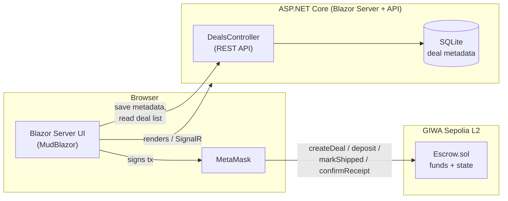

# Ubuntu Escrow — Technical Design

**Decentralized peer-to-peer escrow marketplace on GIWA L2.**
Funds are locked in an audited smart contract and only released when both parties confirm the deal went through — no intermediary holds the money.

The escrow logic is a **Solidity** smart contract; the web application is a full **C#/.NET** stack (Blazor Server) that talks to that contract via **Nethereum**, with MetaMask as the signing wallet. No custom backend chain node, indexer, or JS frontend framework — one language (C#) end to end on the app side, one language (Solidity) on the trust-critical side.

- **Live demo:** https://ubuntupay.africa
- **Verified contract:** [`0xabBDDF83285daa096381E5E4b312afCACA36686a`](https://sepolia-explorer.giwa.io/address/0xabBDDF83285daa096381E5E4b312afCACA36686a) on GIWA Sepolia (chain ID `91342`)
- **Repo:** https://github.com/block0xhash/ubuntu-escrow

## Problem

Peer-to-peer trade (goods, services, freelance work) between parties who don't know each other has no trust anchor — the buyer risks paying and never receiving, the seller risks shipping and never getting paid. Centralized escrow (PayPal, bank holds) requires trusting a third party with custody and charges high fees. Ubuntu Escrow replaces that third party with a smart contract.

## Architecture

A hybrid on-chain / off-chain design: the contract is the source of truth for **funds and state transitions**; a lightweight off-chain index mirrors deal metadata (titles, descriptions) for a fast, normal web UI, since that data doesn't need to live on-chain.



The contract never stores a title or description — only what's needed to move funds safely: parties, amount, and status. The web layer never touches funds — it only records the transaction hash of what already happened on-chain and lets you browse/search deals.

## Tech Stack

| Layer | Choice | Why |
|---|---|---|
| Smart contract | Solidity 0.8.33, OpenZeppelin (`ReentrancyGuard`, `Ownable`) | Battle-tested primitives instead of hand-rolled access control / reentrancy protection |
| Contract tooling | Foundry (forge) | Fast native tests, scriptable deploys, built-in verification support |
| Frontend | Blazor Server (.NET 10), MudBlazor | Server-rendered C# UI — no separate JS build pipeline, wallet interop via minimal JS bridge |
| Off-chain store | SQLite + Dapper | Zero-ops metadata index; disposable by design (source of truth is always the chain) |
| Chain interaction | Nethereum (ABI encoding) + MetaMask (`window.ethereum`) via JS interop | User's own wallet signs every transaction — the app never holds a private key |
| Network | GIWA Sepolia L2 | Low gas, fast finality, EVM-compatible |

## Contract Design — Deal Lifecycle

```
Created ──deposit()──▶ Funded ──markShipped()──▶ Shipped ──confirmReceipt()──▶ Released
                                                       │
                                                       ├──claimTimeout()──▶ Released  (7-day auto-release if buyer goes silent)
                                                       └──raiseDispute()──▶ Disputed ──resolveDispute()──▶ Released | Refunded
```

| Function | Caller | Effect |
|---|---|---|
| `createDeal(seller, collateral, targetBuyer)` | Seller (or buyer, if funding immediately) | Lists a deal. `targetBuyer = address(0)` → open marketplace; a specific address → **private deal**, enforced on-chain |
| `deposit(dealId)` | Buyer | Funds an open `Created` deal. Reverts if the deal is private and caller isn't the designated buyer |
| `markShipped(dealId)` | Seller only | Advances `Funded → Shipped`, starts the 7-day timeout clock |
| `confirmReceipt(dealId)` | Buyer only | Releases funds: 99% to seller, 1% platform fee to treasury |
| `claimTimeout(dealId)` | Anyone | If shipped >7 days with no buyer response, releases funds the same way — prevents funds getting stuck on an unresponsive buyer |
| `raiseDispute` / `resolveDispute` | Party / contract owner | Freezes a deal and lets the owner arbitrate a refund or release |

> **Scope note:** Dispute resolution exists at the contract level (`raiseDispute`/`resolveDispute`) and is covered by a passing test, but **it is not exposed in the MVP frontend** — there is no UI flow for a buyer or seller to raise a dispute, or for an admin to resolve one. This is a deliberate scope cut for the MVP, not an oversight, and is called out again in the roadmap table below.

**Security:** `nonReentrant` on every fund-moving function, `Ownable` gating admin-only paths (treasury changes, dispute resolution), and the private-deal restriction is enforced by the contract itself (`require(deal.targetBuyer == address(0) || deal.targetBuyer == msg.sender)`) — not just hidden by the UI, so it can't be bypassed by calling the contract directly.

**Tested:** 7 Foundry tests covering the full happy path, fee split, auto-release timeout, dispute refund, and both private-deal enforcement cases (correct buyer succeeds, wrong buyer reverts).

## What's Built vs. Roadmap

| Built now | Roadmap |
|---|---|
| Full create → fund → ship → confirm → release lifecycle, on-chain, tested and verified | **Dispute resolution UI** — not in the MVP. Contract-level `raiseDispute`/`resolveDispute` exist and are tested, but no frontend flow calls them |
| Public and private (restricted-buyer) deal types, enforced on-chain | Admin panel actions (currently placeholder) |
| Wallet-native UX (MetaMask), auto network-switch to GIWA Sepolia | Server-side verification of submitted tx hashes against chain state (currently trusts the client) |
| Per-deal transaction audit trail linking to the block explorer | Collateral/staking mechanism (field exists in the contract, not yet exposed in the UI) |

This is deliberately scoped: the core trust primitive (locked funds, on-chain-enforced release conditions) is complete and tested; the parts left for the roadmap are operational/UX surface area, not the trust model itself.

## Roadmap

**Close the remaining trust/security gaps**
- Server-side verification of on-chain state (an event-indexer or periodic reconciliation) instead of trusting client-submitted transaction hashes — the biggest architectural gap in the current MVP
- Dispute resolution UI, wired to the existing `raiseDispute` / `resolveDispute` contract functions
- Independent security audit before any mainnet deployment handles real funds

**Reduce adoption friction — shield non-technical users from crypto entirely**
- Account abstraction paymasters (ERC-4337) so the platform (or seller) can sponsor gas — a first-time user shouldn't need to already own gas tokens to complete their first deal
- Social login (Google/Apple/phone-number) backed by an embedded/smart-contract wallet, so a non-technical user never sees a seed phrase, a private key, or "connect MetaMask" — they just sign in and trade
- Full fiat on/off-ramp — deposit and withdraw in local currency, with the platform handling the stablecoin conversion behind the scenes
- ERC-20 stablecoin support (e.g. USDC) as the underlying settlement asset — pricing a real-world trade in volatile ETH is a genuine barrier even for crypto-native users

**Extend the trust model**
- On-chain reputation / deal-history scoring for repeat buyers and sellers, so trust compounds beyond a single escrow
- Collateral/staking for private deals (the `collateralPosted` field already exists in the contract; not yet enforced or exposed)
- Multiple-designated-buyer / auction-style private deals

**Scale**
- Mainnet deployment once GIWA's mainnet is live
- Push notifications (deal funded / shipped / released) instead of requiring a manual page refresh
- Localization for target markets
